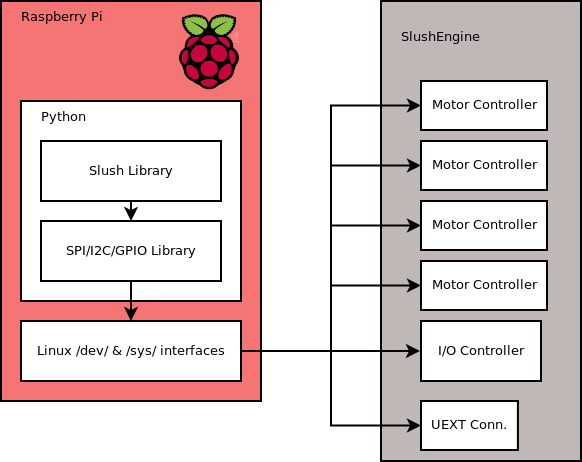

### How Slush Works: Going from the Software to the Hardware
If you are interested in how the SlushEngine works this page may be interesting. It talked about the basic systems that make all the majic happen. This page may also be a good introduction if you plan on developing your own hardware. First lets take a look at the overal system layout. In this system we will look at the Linux board as a Raspberry Pi, however the communication protocols are avalible on many other Linux based systems. 



Above is a simple layout of the SlushEngine communication system. The idea behind the SlushEngine hardware design was to keep all interfacing simple to that poeple with hardware or software experience could develope on to it.

When you open up a Python shell for the first time after installing the Slush library you will probably start off by importing slush. This will load the Slush library into you Linux computers RAM making it avalible for fast access.
```python
import Slush
```
The next thing we do is define what objects are in our system. The python sBoard class carries all of the physical interfaces and is a parent to every other type of control that the Slush system will use. When we import sBoard all of the hardware interfaces become initalized and check. We will delve into those a little later. 
```python
myBoard = Slush.sBoard()
```
Now that we have all of our hardware interfaces defined it is time to do some cool things. First we want to create a motor object. The interesting thing about this is that now we can use our motor as a variable that can be used by other functions and indexed the way you might any other variable. When the motor object is initalized it also communicates with the motor driver and sets up some basic parameters. This will create a motor as physically labeled on the board.
```python
myMotor0 = Slush.Motor(0)
```
Now that we have our board and motor defined we can use them. The details of the below commands dont matter very much right now.
```python
myMotor0.move(-1000)
myBoard.setIOState(1,1,1)
```
Here things are going to move in a hardware communications direction. Once we have issued these commands Python now works with peripheral buses that are attached to the Linux System. The Slush hardware uses the 3 most common interfaces; SPI, I2C and GPIO.